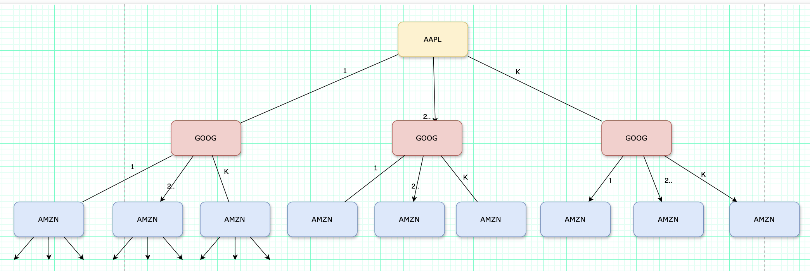

<a id="readme-top"></a>


<br />
<div align="center">
  <a href="https://github.com/harshsavasil/hot-partition-problem">
    
  </a>

  <h3 align="center">hot-partition-problem</h3>

  <p align="center">
    A solution to avoid hot partitions while distributing your load.
    <br />
    <br />
    <br />
    <a href="https://github.com/harshsavasil/hot-partition-problem/blob/master/generate_partitions.py">View Code</a>
    &middot;
    <a href="https://github.com/harshsavasil/hot-partition-problem/issues/new">Report Bug</a>
    &middot;
    <a href="https://github.com/harshsavasil/hot-partition-problem/issues/new">Request Feature</a>
  </p>
</div>
<br />

<!-- TABLE OF CONTENTS -->
<details>
  <summary>Table of Contents</summary>
  <ol>
    <li>
      <a href="#about-the-algorithm">About The Algorithm</a>
    </li>
    <li>
      <a href="#getting-started">Getting Started</a>
      <ul>
        <li><a href="#prerequisites">Prerequisites</a></li>
        <li><a href="#installation">Installation</a></li>
      </ul>
    </li>
    <li><a href="#usage">Usage</a></li>
    <li><a href="#contributing">Contributing</a></li>
    <li><a href="#contact">Contact</a></li>
  </ol>
</details>


<!-- ABOUT THE PROJECT -->
## About the Algorithm
The algorithm uses a recursive backtracking approach to distribute N stocks across K partitions while minimizing the maximum load on any partition and balancing the overall distribution.

Key aspects of the algorithm:

1. **Optimization Goal**: 
   - Minimize the maximum load (trading volume) on any partition
   - Minimize deviation between partition loads for better balance

2. **Heuristic Optimization**:
   - Uses a threshold based on minimum possible maximum load to prune recursion branches
   - Minimum possible maximum = max(highest_volume, total_volume/num_partitions)
   - Skips branches where partition sum would exceed threshold

3. **Recursive Assignment**:
   - Sorts stocks by volume in descending order for faster convergence
   - For each stock, tries assigning it to each partition recursively
   - Backtracks if assignment leads to suboptimal solution
   - Maintains running sums and stock lists for each partition

4. **Solution Tracking**:
   - Tracks global minimum (maximum load across partitions)
   - Tracks global deviation (sum of differences from ideal load)
   - Updates best distribution when better solution found

5. **Solution Validation**:
   - Ensures no empty partitions in final distribution
   - Validates both minimum load and load deviation
   - Outputs distribution to JSON file when better solution found

The algorithm guarantees finding an optimal distribution if one exists within the threshold constraints, though runtime increases exponentially with number of stocks and partitions.


<!-- GETTING STARTED -->
## Getting Started
To get a local copy up and running follow these simple example steps.

### Prerequisites

* Install Python

### Installation

1. Clone the repo
   ```sh
   git clone https://github.com/harshsavasil/hot-partition-problem.git
   ```
2. Install required packages
   ```sh
   pip install -r requirements.txt
   ```
3. Change git remote url (if you plan to contribute)
   ```sh
   git remote set-url origin YOUR_FORKED_REPO_URL
   git remote -v # confirm the changes
   ```

<p align="right">(<a href="#readme-top">back to top</a>)</p>


<!-- USAGE EXAMPLES -->
## Usage

Here's how to use the partition algorithm:

1. Prepare your input data in JSON format:
```json
{
    "stocks": [
        {"symbol": "AAPL", "volume": 1000000},
        {"symbol": "GOOGL", "volume": 800000},
        // ... more stocks
    ],
    "num_partitions": 3
}
```

2. Run the algorithm:

```
python generate_partitions.py
```

3. Get optimized partition results in output folder:
```json
{
  "deviation": XX, # Maximum deviation from ideal load
  "minimum": XX, # Minimum possible maximum load per partition
  "partitions": [{
    "sum": XX, # Sum of all elements in the partition
    "elements": [XX, XX, XX, ...], # Elements in the partition
    "stocks": ["AAPL", "AMZN", "GOOG", ...] # Stocks in the partition
  }]
}
```


<!-- CONTRIBUTING -->
## Contributing

Contributions are what make the open source community such an amazing place to learn, inspire, and create. Any contributions you make are **greatly appreciated**.

If you have a suggestion that would make this better, please fork the repo and create a pull request. You can also simply open an issue with the tag "enhancement".
Don't forget to give the project a star! Thanks again!

1. Fork the Project
2. Create your Feature Branch (`git checkout -b feature/AmazingFeature`)
3. Commit your Changes (`git commit -m 'Add some AmazingFeature'`)
4. Push to the Branch (`git push origin feature/AmazingFeature`)
5. Open a Pull Request


<!-- CONTACT -->
## Contact

Harsh Gupta - [@harshsavasil](https://twitter.com/harshsavasil) - harshsavasil1995@gmail.com

Project Link: [https://github.com/harshsavasil/hot-partition-problem](https://github.com/harshsavasil/hot-partition-problem)


<p align="right">(<a href="#readme-top">back to top</a>)</p>
